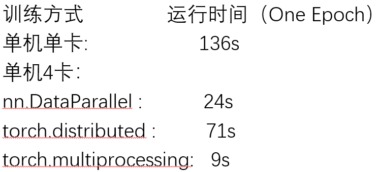

# PGU-net-Model PyTorch1.0 Python3.7 with multi GPUs

This is my contribution to the "PGU-net+: Progressive Growing of U-net+ for Automated Cervical Nuclei Segmentation" in MICCAI2019 workshop MMMI.

Paper link: http://arxiv.org/abs/1911.01062
 Please cite this paper if you find this project helpful for your research.

# Dependencies

python 3.7, CUDA 10.1, numpy 1.17, matplotlib 3.1.1, scikit-image (0.21), scipy (0.3.1), pyparsing (2.4.2), pytorch (1.0) (anaconda is recommended)
other packages could be the latest version.

# Training:

1.Install all dependencies

2.For PGU-net+: Progressive Growing of U-net+,
python train_PG.py

For the U-net structure in the final stag,
python train.py

# Testing:
For testing,
python test.py

# Distributed training mode
In the later stage, several parallel and distributed training methods of multi GPU are added，参考自https://github.com/tczhangzhi/pytorch-distributed

1.nn.DataParallel 简单方便的 nn.DataParallel

2.torch.distributed 使用 torch.distributed 加速并行训练

3.torch.multiprocessing 使用 torch.multiprocessing 取代启动器

4.apex 使用 apex 再加速

5.horovod horovod 的优雅实现

For the U-net structure with 5 distributed training methods above

python train_1024_DataParallel.py for nn.DataParallel

python train_1024_distributed.py for torch.distributed

python train_1024_multiprocessing.py for torch.multiprocessing

python train_1024_apex.py for apex

python train_1024_horovod.py for horovod

实验结果如下图（apex和horovod存在一些bug）：

